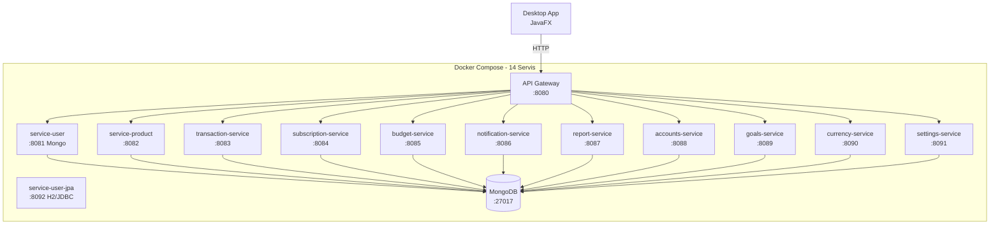

# CepteFinans - Kişisel Finans Yönetim Uygulaması

TBL324 - İleri Java Uygulamaları Dersi Projesi

**Kurum:** Kocaeli Üniversitesi, Teknoloji Fakültesi, Bilgisayar Mühendisliği Bölümü

## Grup bilgisi

| Alan | Bilgi |
|------|--------|
| Grup / proje | TBL324 dönem projesi — CepteFinans |
| Teslim kapsamı | Mikroservis arka uç, API Gateway, MongoDB (+ JDBC/H2 örneği), JavaFX masaüstü, Docker Compose, testler, k6 |

## Ekip üyeleri

| Ad Soyad | Öğrenci no. |
|----------|-------------|
| Emre Yüksel | 221307103 |
| Yunus Emir Atıcı | 221307040 |

İletişim ve kod paylaşımı Git üzerinden yapılmıştır. Toplantılar çevrim içi gerçekleştirilmiştir.

## Proje konusu

CepteFinans, kullanıcıların kişisel finanslarını tek bir masaüstü uygulaması üzerinden yönetmesini sağlar: gelir–gider ve işlem kayıtları, bütçe ve abonelik takibi, hesap ve varlık yönetimi, tasarruf hedefleri, raporlar (grafik ve PDF), döviz/kripto kurları ve alarmlar, bildirimler ile profil ve uygulama ayarları.

Teknik olarak sistem mikroservis mimarisiyle kurgulanmıştır: Spring Cloud API Gateway, MongoDB, JavaFX istemci, Docker Compose dağıtımı ve OpenAPI ile belgelenmiş REST API’ler.

## Görev dağılımı

Proje boyunca işler **büyük ölçüde birlikte** yürütülmüştür; katı bir “sadece bir kişi şu modülü yazdı” ayrımı tutulmamıştır. Her iki ekip üyesi de mimari, kod, test ve dokümantasyon aşamalarında yer almıştır.

| Çalışma alanı | Emre Yüksel | Yunus Emir Atıcı |
|---------------|:-----------:|:----------------:|
| Mikroservis, gateway, Docker Compose | ✓ | ✓ |
| Kullanıcı servisi, giriş ve kayıt | ✓ | ✓ |
| İşlem, bütçe, abonelik | ✓ | ✓ |
| Hesaplar, hedefler, ayarlar | ✓ | ✓ |
| Rapor, bildirim, döviz | ✓ | ✓ |
| JavaFX arayüz ve özel grafikler | ✓ | ✓ |
| common-lib, generic katman, hata yönetimi | ✓ | ✓ |
| Testler (JUnit, MockMvc, Testcontainers) | ✓ | ✓ |
| k6, README, demo veri (`seed.ps1`) | ✓ | ✓ |

**Çalışma biçimi:** Git commit’leri, Swagger ile API kontrolü, Docker ile ortak ortam, haftalık kısa toplantılar; bloklayıcı hatalarda birlikte debug.

## Proje özeti

**CepteFinans**, günlük finansı tek noktada toplamak için geliştirilmiş bir kişisel finans platformudur. Kullanıcı; işlem, bütçe ve abonelik takibinin yanı sıra hesap ve varlık yönetimi, tasarruf hedefleri, grafik raporları, döviz ve kripto kurları, bildirimler ve kişisel ayarlar için JavaFX masaüstü istemcisini kullanır. Tüm özellikler, **Spring Cloud Gateway** arkasındaki küçük ve odaklı **Spring Boot mikroservisleri** üzerinden **REST API** ile sunulur; kalıcı veri **MongoDB** ile saklanır.

Proje; **generic repository ve servis soyutlamaları**, **Observer**, **Strategy** ve **Template Method** gibi tasarım kalıpları, **Swagger/OpenAPI** ile API sözleşmesi, **Docker Compose** ile çok konteynerli çalıştırma, **birim ve entegrasyon testleri** (JUnit, Mockito, Testcontainers) ve **k6** ile yük testi altyapısı içerir.

## Depo yapısı

| Yol | İçerik |
|-----|--------|
| `backend/` | Maven üst POM, `common-lib`, `api-gateway`, alan mikroservisleri (`service-user`, `service-product`, …) |
| `desktop-app/` | JavaFX masaüstü istemci (HttpClient, Jackson) |
| `docker-compose.yml` | MongoDB, gateway, mikroservis konteynerleri |
| `k6/` | Yük testi betikleri ve isteğe bağlı JSON çıktı |
| `seed.ps1` | Demo veri yükleme (PowerShell) |
| `scripts/` | Yardımcı otomasyon (ör. ODT/rapor betikleri) |

## Ön gereksinimler

- **JDK 17** ve **Maven 3.9+**
- **Docker** ve **Docker Compose** (tam yığın için)
- **PowerShell** (`seed.ps1` için; isteğe bağlı)
- **k6** (performans testi bölümü için; isteğe bağlı)

**Docker:** `backend/Dockerfile` çok aşamalıdır; imaj içinde Maven ile modül derlenir. İsterseniz önce `cd backend && mvn package -DskipTests` ile yerel JAR da üretebilirsiniz. Tam yığın: `docker compose up -d --build`.

## Mimari



## Teknoloji Yığını

| Katman | Teknoloji |
|--------|-----------|
| Backend | Spring Boot 3.3.2, Java 17 |
| Microservice | 11 alan servisi + kullanıcı (Mongo + ayrı JPA/H2 demoları) + API Gateway (Docker’da 13 Spring uygulaması) |
| Gateway | Spring Cloud Gateway 2023.0.3 |
| Database | MongoDB 7.0 (NoSQL) + H2/JPA (service-user-jpa) |
| Desktop | JavaFX 21.0.2, HttpClient, Jackson |
| Auth | BCrypt şifre hashleme, email/şifre giriş |
| PDF | OpenPDF 2.0.3 |
| Döviz API | ExchangeRate-API (fiat) + CoinGecko (kripto) |
| Container | Docker Compose |
| API Doc | Swagger / OpenAPI 3.0 |
| Test | JUnit 5, Mockito, Testcontainers |
| Perf | k6 |
| Build | Maven 3.9 |

## Özellikler

| Sayfa | Durum | Açıklama |
|-------|-------|----------|
| Giriş / Kayıt | ✓ | Giriş yap, kayıt ol, kayıt sonrası otomatik oturum |
| Dashboard | ✓ | Dinamik kartlar, grafikler, otomatik yenileme (60sn) |
| İşlemler | ✓ | CRUD, toplu silme, CSV export, çift tıklama düzenleme |
| Bütçeler | ✓ | Ekleme/düzenleme/silme, onay dialogu |
| Hesaplar & Varlıklar | ✓ | API bağlantılı, ekleme/düzenleme/silme |
| Tasarruf Hedefleri | ✓ | İlerleme çubuğu, para ekleme |
| Raporlar | ✓ | Trend/kategori/özet grafikleri, PDF indir |
| Döviz & Kripto | ✓ | Canlı kur (ExchangeRate-API + CoinGecko), fiyat alarmı |
| Bildirimler | ✓ | Detay paneli, okunmamış badge, cross-service entegrasyon |
| Ayarlar | ✓ | Profil, uygulama ayarları, veri içe/dışa aktar |

## API Dokümantasyonu

| Servis | Port | Swagger |
|--------|------|---------|
| api-gateway | 8080 | Tüm route'lar `/api/*` altında |
| service-user | 8081 | http://localhost:8081/swagger-ui.html (MongoDB) |
| service-user-jpa | 8092 | http://localhost:8092/swagger-ui.html (H2/JDBC), H2 Console: `/h2-console` |
| service-product | 8082 | http://localhost:8082/swagger-ui.html |
| transaction-service | 8083 | http://localhost:8083/swagger-ui.html |
| subscription-service | 8084 | http://localhost:8084/swagger-ui.html |
| budget-service | 8085 | http://localhost:8085/swagger-ui.html |
| notification-service | 8086 | http://localhost:8086/swagger-ui.html |
| report-service | 8087 | http://localhost:8087/swagger-ui.html |
| accounts-service | 8088 | http://localhost:8088/swagger-ui.html |
| goals-service | 8089 | http://localhost:8089/swagger-ui.html |
| currency-service | 8090 | http://localhost:8090/swagger-ui.html |
| settings-service | 8091 | http://localhost:8091/swagger-ui.html |

## Kurulum

```bash
# 1. (İsteğe bağlı) Yerel derleme ve test
cd backend && mvn package -DskipTests

# 2. Docker ile tüm sistemi başlat (imaj içinde de derlenir)
docker compose up -d --build

# Kullanıcı servisi iki profilde çalışır:
# - service-user (8081): MongoDB — gateway ve desktop bu adresi kullanır
# - service-user-jpa (8092): H2/JDBC demo — curl http://localhost:8092/api/users

# 3. Demo verileri yükle
powershell -File seed.ps1

# 4. Desktop uygulamayı çalıştır
mvn javafx:run -f desktop-app/pom.xml

# Demo Giriş
# E-posta: emreyuksell78@gmail.com
# Şifre: 123
```

### Döviz/kripto canlı veri sorun giderme

`currency-service` konteynerinin dış internete çıkabildiğini doğrulayın:

```powershell
docker exec currency-service wget -qO- "https://api.binance.com/api/v3/ticker/24hr?symbol=BTCTRY"
```

Canlı durum: `GET http://localhost:8080/api/currency/status` → `lastRefreshLive: true`. Masaüstünde yedek kurlar için sarı uyarı gösterilir.

## Design Patterns

| Pattern | Kullanım Yeri | Açıklama |
|---------|--------------|----------|
| **Observer** | notification-service | `NotificationEvent` → `NotificationEventListener` ile event-driven bildirim |
| **Strategy** | report-service | `ReportGenerationStrategy` → `MonthlySummaryStrategy`, `CategoryBreakdownStrategy` |
| **Template Method** | common-lib | `AbstractGenericService` (entity) + `AbstractGenericDtoService` (DTO) ile CRUD şablonu |
| **Repository** | Tüm servisler | `GenericRepository<T,ID>` Spring Data MongoDB üzerinde |
| **Gateway** | api-gateway | Spring Cloud Gateway ile routing, load balancing |
| **Scheduled** | currency-service, notification-service | `@Scheduled` ile periyodik kur güncelleme ve bildirim kontrolü |

## SOLID Prensipleri

| Prensip | Uygulama |
|---------|----------|
| **S**ingle Responsibility | Her servis tek domain (User, Product, Transaction...) |
| **O**pen/Closed | Strategy pattern ile yeni rapor türleri eklenebilir |
| **L**iskov Substitution | GenericService arayüzü tüm servislerde aynı |
| **I**nterface Segregation | Her servis kendi interface'ine sahip |
| **D**ependency Inversion | Constructor injection, interface'e bağımlılık |

## Performans Testleri (k6)

```bash
docker compose up -d
k6 run k6/load-test.js
# JSON rapor: k6 run --out json=k6/report.json k6/load-test.js
```

| Metrik | Değer (son koşu) |
|--------|------------------|
| Ortalama gecikme (avg) | ~6.6 ms |
| p95 gecikme | ~12.6 ms |
| Throughput | ~26 req/s |
| Hata oranı | 0% |
| Test edilen endpoint | login, products, transactions, budgets, accounts, goals + POST transactions |

## Hata Yönetimi

Tüm mikroservisler `common-lib` içindeki `GlobalExceptionHandler` ile standart `ApiErrorResponse` gövdesi döner (`timestamp`, `status`, `error`, `message`, `path`).

| HTTP Kodu | Durum |
|-----------|-------|
| 200 | Başarılı |
| 201 | Oluşturuldu |
| 204 | Silindi |
| 400 | Validasyon hatası / Geçersiz argüman / bozuk JSON |
| 401 | Yetkisiz (`UnauthorizedException`, örn. hatalı giriş) |
| 404 | Kaynak bulunamadı |
| 500 | Sunucu hatası |


## Arayüz – Backend uyumu (tarama özeti)

| Durum | Konu | Açıklama |
|-------|------|----------|
| Düzeltildi | İşlem düzenleme | Çift tıklayınca artık `PUT /api/transactions/{id}` (önceden hep yeni kayıt açıyordu) |
| Düzeltildi | Hedefe para ekleme | `PATCH .../deposit` gövdesine `amount` gönderiliyor |
| Düzeltildi | Ayar anahtarları | Koyu tema vb. toggle’lar `settings` JSON’u ile doğru kaydediliyor |
| Düzeltildi | Kullanıcıya özel listeler | İşlem, bütçe, hedef, hesap, varlık, bildirimler `.../user/{id}` ile yükleniyor |
| Düzeltildi | Döviz alarmı aç/kapa | `PUT .../toggle` boş gövde ile çağrılıyor |
| Kısmen | Şifremi unuttum | Bilgi mesajı (backend’de sıfırlama yok) |
| Kısmen | Beni hatırla | Yalnızca arayüz; oturum saklama yok |
| Kısmen | Rapor türü seçimi | Combo kutusu görsel; veri her zaman trend/kategori/özet API’lerinden gelir |
| Kısmen | Koyu tema | Ayar MongoDB’de saklanır; tüm ekran teması anında değişmez |
| Kısmen | İki faktörlü doğrulama | Ayar bayrağı var; gerçek 2FA akışı yok |
| Kısmen | Raporlar (analytics) | `summary`/`trend` kullanıcıya göre filtrelenmez (report-service genel veri) |
| Düzeltildi | Abonelikler | Ayrı menü; aktif abonelik tutarları dashboard giderine dahil |
| Yok | Mobil arayüz | Kapsam dışı |
