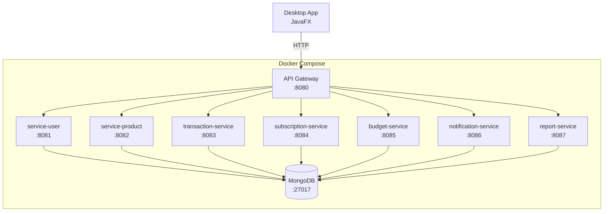
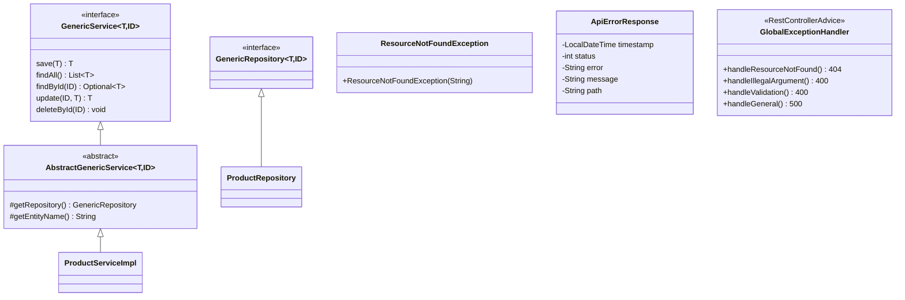
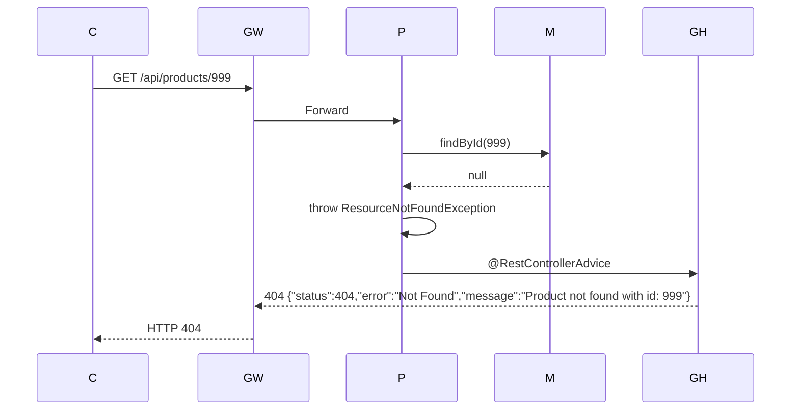

# CepteFinans - Kişisel Finans Yönetim Uygulaması

TBL324 - İleri Java Uygulamaları Dersi Projesi

## Mimari



## Teknoloji Yığını

| Katman | Teknoloji |
|--------|-----------|
| Backend | Spring Boot 3.3.2, Java 17 |
| Microservice | 7 izole servis + API Gateway |
| Gateway | Spring Cloud Gateway 2023.0.3 |
| Database | MongoDB (NoSQL), H2 (JDBC - User Service) |
| Desktop | JavaFX 21.0.2, HttpClient, Jackson |
| Container | Docker Compose |
| API Doc | Swagger / OpenAPI 3.0 |
| Test | JUnit 5, Mockito, Testcontainers |
| Perf | k6 |
| Build | Maven 3.9 |

## Paket Yapısı



## Design Patterns

| Pattern | Kullanım Yeri | Açıklama |
|---------|--------------|----------|
| **Observer** | notification-service | `NotificationEvent` → `NotificationEventListener` ile event-driven bildirim |
| **Strategy** | report-service | `ReportGenerationStrategy` → `MonthlySummaryStrategy`, `CategoryBreakdownStrategy` |
| **Template Method** | common-lib | `AbstractGenericService` ile CRUD şablonu |
| **Repository** | Tüm servisler | `GenericRepository<T,ID>` Spring Data MongoDB üzerinde |
| **Gateway** | api-gateway | Spring Cloud Gateway ile routing, load balancing |
| **Singleton** | desktop-app | `AuthManager` JWT token yönetimi |

## API Dokümantasyonu

Her servis için Swagger UI:

| Servis | Port | Swagger |
|--------|------|---------|
| service-user | 8081 | http://localhost:8081/swagger-ui.html |
| service-product | 8082 | http://localhost:8082/swagger-ui.html |
| transaction-service | 8083 | http://localhost:8083/swagger-ui.html |
| subscription-service | 8084 | http://localhost:8084/swagger-ui.html |
| budget-service | 8085 | http://localhost:8085/swagger-ui.html |
| notification-service | 8086 | http://localhost:8086/swagger-ui.html |
| report-service | 8087 | http://localhost:8087/swagger-ui.html |

Gateway: http://localhost:8080 (tüm endpoint'ler `/api/*` altında)

## Kurulum

```bash
# 1. JAR'ları oluştur
cd backend && mvn package -DskipTests

# 2. Docker Compose ile tüm sistemi başlat
docker compose up -d

# 3. Desktop uygulamayı çalıştır
mvn javafx:run -f desktop-app/pom.xml
```

## SOLID Prensipleri

| Prensip | Uygulama |
|---------|----------|
| **S**ingle Responsibility | Her servis tek domain (User, Product, Transaction...) |
| **O**pen/Closed | Strategy pattern ile yeni rapor türleri eklenebilir |
| **L**iskov Substitution | GenericService arayüzü tüm servislerde aynı |
| **I**nterface Segregation | Her servis kendi interface'ine sahip |
| **D**ependency Inversion | Constructor injection, interface'e bağımlılık |

## Hata Yönetimi



| HTTP Kodu | Durum |
|-----------|-------|
| 200 | Başarılı |
| 201 | Oluşturuldu |
| 204 | Silindi |
| 400 | Validasyon hatası / Geçersiz argüman |
| 404 | Kaynak bulunamadı |
| 500 | Sunucu hatası |

## Test Sonuçları

```
134 / 134 PASSED

service-product     : 28 test (controller:7, service:7, repository:4, integration:3)
service-user        : 18 test (controller:6, service:3)
transaction-service : 22 test (controller:7, service:4)
subscription-service: 18 test (controller:6, service:3)
budget-service      : 18 test (controller:5, service:4)
notification-service: 16 test (controller:5, service:3)
report-service      : 14 test (controller:4, service:3)
```

**TDD Kanıtı:** Git commit geçmişinde test (RED) → implementasyon (GREEN) sıralaması mevcuttur.

## Performans Testi (k6)

**Test Senaryosu:** 50 VUs, 2 dakika (ramp-up 30s → steady 60s → ramp-down 30s)

| Metrik | Değer | Eşik | Sonuç |
|--------|-------|------|-------|
| Toplam İstek | 3,137 | - | - |
| Başarı Oranı | %100 | >%99 | ✓ |
| Ortalama Gecikme | 6.55ms | - | - |
| p95 Gecikme | 12.6ms | <1000ms | ✓ |
| p90 Gecikme | 10.38ms | - | - |
| Maksimum Gecikme | 74.68ms | - | - |
| RPS (Requests/s) | 26.13/s | - | - |
| Hata Oranı | %0.00 | <%1 | ✓ |
| Veri Alınan | 402 kB | - | - |
| Veri Gönderilen | 257 kB | - | - |

## Git Commit Stratejisi (TDD)

```
cc22173 init: project structure, parent POM, docker-compose, k6 skeleton
707e357 feat(common-lib): GenericRepository, GenericService, AbstractGenericService...
412331c test(product): add ProductControllerTest, ProductServiceTest... (RED)
3a44798 feat(product): implement Product model, repository, service... (GREEN)
d18a8d9 test: add User,Transaction,Subscription,Budget... tests (RED)
acd9be2 feat(user+gateway): DualUserService (JDBC+NoSQL), API Gateway... (GREEN)
ecdb1f4 feat(transaction+subscription): CRUD with filters, cancel... (GREEN)
bc7da54 feat(budget+notification+report): checkBudgetLimit, Observer, Strategy (GREEN)
acc4338 feat(desktop): JavaFX login, dashboard with charts, CRUD tabs, dark theme
c36999a chore: desktop CSS theme, mobile app Android skeleton
```

## Değerlendirme Kriterleri Karşılama

| Kriter | Puan | Durum |
|--------|------|-------|
| API & Back-end | 10 | ✓ 7 microservice |
| Generic Yapılar | 10 | ✓ GenericRepository, GenericService |
| Custom GUI | 10 | ✓ JavaFX + PieChart + BarChart + ProgressBar |
| JDBC & NoSQL | 10 | ✓ MongoDB + H2/JPA (DualUserService) |
| SOLID & OOP | 10 | ✓ Observer + Strategy + Template Method + SOLID |
| Hata Yönetimi | 5 | ✓ GlobalExceptionHandler (4xx, 5xx) |
| Performans Testleri | 5 | ✓ k6: 3137 istek, 0 hata, p95=12.6ms |
| Analiz & Doküman | 5 | ✓ README + Mermaid + k6 raporu |
| **Zorunlu Toplam** | **65** | ✓ |
| Mikroservis Mimarisi | +10 | ✓ 7 servis + Gateway |
| Gateway | +5 | ✓ Spring Cloud Gateway |
| Test-Driven Geliştirme | +10 | ✓ RED→GREEN commit geçmişi |
| Dockerize Sistem | +5 | ✓ docker compose up |
| **Ek Özellikler** | **+30** | |
| **Genel Toplam** | **95** | |
