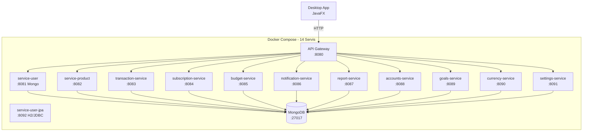

# CepteFinans - Kişisel Finans Yönetim Uygulaması

TBL324 - İleri Java Uygulamaları Dersi Projesi

## Mimari



## Teknoloji Yığını

| Katman | Teknoloji |
|--------|-----------|
| Backend | Spring Boot 3.3.2, Java 17 |
| Microservice | 12 izole servis + API Gateway |
| Gateway | Spring Cloud Gateway 2023.0.3 |
| Database | MongoDB 7.0 (NoSQL) + H2/JPA (service-user-jpa) |
| Desktop | JavaFX 21.0.2, HttpClient, Jackson |
| Auth | BCrypt şifre hashleme, email/şifre giriş |
| PDF | OpenPDF 2.0.3 |
| Döviz API | ExchangeRate-API (fiat) + CoinGecko (kripto) |
| Container | Docker Compose |
| API Doc | Swagger / OpenAPI 3.0 |
| Test | JUnit 5, Mockito, Testcontainers |
| Perf | k6 |
| Build | Maven 3.9 |

## Özellikler

| Sayfa | Durum | Açıklama |
|-------|-------|----------|
| Dashboard | ✓ | Dinamik kartlar, grafikler, otomatik yenileme (60sn) |
| İşlemler | ✓ | CRUD, toplu silme, CSV export, çift tıklama düzenleme |
| Bütçeler | ✓ | Ekleme/düzenleme/silme, onay dialogu |
| Hesaplar & Varlıklar | ✓ | API bağlantılı, ekleme/düzenleme/silme |
| Tasarruf Hedefleri | ✓ | İlerleme çubuğu, para ekleme |
| Raporlar | ✓ | Trend/kategori/özet grafikleri, PDF indir |
| Döviz & Kripto | ✓ | Canlı kur (ExchangeRate-API + CoinGecko), fiyat alarmı |
| Bildirimler | ✓ | Detay paneli, okunmamış badge, cross-service entegrasyon |
| Ayarlar | ✓ | Profil, uygulama ayarları, veri içe/dışa aktar |

## API Dokümantasyonu

| Servis | Port | Swagger |
|--------|------|---------|
| api-gateway | 8080 | Tüm route'lar `/api/*` altında |
| service-user | 8081 | http://localhost:8081/swagger-ui.html (MongoDB) |
| service-user-jpa | 8092 | http://localhost:8092/swagger-ui.html (H2/JDBC), H2 Console: `/h2-console` |
| service-product | 8082 | http://localhost:8082/swagger-ui.html |
| transaction-service | 8083 | http://localhost:8083/swagger-ui.html |
| subscription-service | 8084 | http://localhost:8084/swagger-ui.html |
| budget-service | 8085 | http://localhost:8085/swagger-ui.html |
| notification-service | 8086 | http://localhost:8086/swagger-ui.html |
| report-service | 8087 | http://localhost:8087/swagger-ui.html |
| accounts-service | 8088 | http://localhost:8088/swagger-ui.html |
| goals-service | 8089 | http://localhost:8089/swagger-ui.html |
| currency-service | 8090 | http://localhost:8090/swagger-ui.html |
| settings-service | 8091 | http://localhost:8091/swagger-ui.html |

## Kurulum

```bash
# 1. JAR'ları oluştur
cd backend && mvn package -DskipTests

# 2. Docker Compose ile tüm sistemi başlat
docker compose up -d

# Kullanıcı servisi iki profilde çalışır:
# - service-user (8081): MongoDB — gateway ve desktop bu adresi kullanır
# - service-user-jpa (8092): H2/JDBC demo — curl http://localhost:8092/api/users

# 3. Demo verileri yükle
powershell -File seed.ps1

# 4. Desktop uygulamayı çalıştır
mvn javafx:run -f desktop-app/pom.xml

# Demo Giriş
# E-posta: emreyuksell78@gmail.com
# Şifre: 123
```

## Design Patterns

| Pattern | Kullanım Yeri | Açıklama |
|---------|--------------|----------|
| **Observer** | notification-service | `NotificationEvent` → `NotificationEventListener` ile event-driven bildirim |
| **Strategy** | report-service | `ReportGenerationStrategy` → `MonthlySummaryStrategy`, `CategoryBreakdownStrategy` |
| **Template Method** | common-lib | `AbstractGenericService` (entity) + `AbstractGenericDtoService` (DTO) ile CRUD şablonu |
| **Repository** | Tüm servisler | `GenericRepository<T,ID>` Spring Data MongoDB üzerinde |
| **Gateway** | api-gateway | Spring Cloud Gateway ile routing, load balancing |
| **Scheduled** | currency-service, notification-service | `@Scheduled` ile periyodik kur güncelleme ve bildirim kontrolü |

## SOLID Prensipleri

| Prensip | Uygulama |
|---------|----------|
| **S**ingle Responsibility | Her servis tek domain (User, Product, Transaction...) |
| **O**pen/Closed | Strategy pattern ile yeni rapor türleri eklenebilir |
| **L**iskov Substitution | GenericService arayüzü tüm servislerde aynı |
| **I**nterface Segregation | Her servis kendi interface'ine sahip |
| **D**ependency Inversion | Constructor injection, interface'e bağımlılık |

## Performans Testleri (k6)

```bash
docker compose up -d
k6 run k6/load-test.js
# JSON rapor: k6 run --out json=k6/report.json k6/load-test.js
```

| Metrik | Değer (son koşu) |
|--------|------------------|
| Ortalama gecikme (avg) | ~6.6 ms |
| p95 gecikme | ~12.6 ms |
| Throughput | ~26 req/s |
| Hata oranı | 0% |
| Test edilen endpoint | login, products, transactions, budgets, accounts, goals + POST transactions |

## Hata Yönetimi

| HTTP Kodu | Durum |
|-----------|-------|
| 200 | Başarılı |
| 201 | Oluşturuldu |
| 204 | Silindi |
| 400 | Validasyon hatası / Geçersiz argüman |
| 401 | Yetkisiz (yanlış şifre) |
| 404 | Kaynak bulunamadı |
| 500 | Sunucu hatası |
